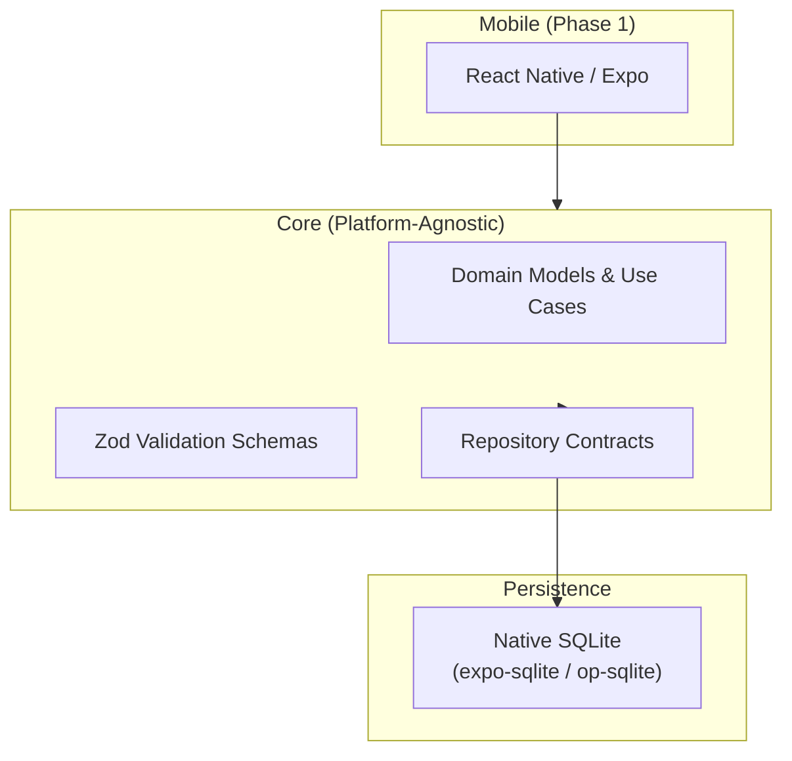

# Luna's Pet Central

An offline-first operations management system for animal shelters. Manage multiple independent shelters on a single device with full lifecycle pet tracking, clinical care scheduling, and structured data portability.

## Overview

Luna's Pet Central replaces fragmented, paper-based shelter operations with a unified digital solution. The Phase 1 MVP delivers a 100% offline-first mobile application that runs entirely on-device with no network dependency.

**Key capabilities:**
- Register and manage multiple shelters on a single device
- Track pet profiles through their complete lifecycle (intake → adoption, transfer, foster, or death)
- Schedule and log veterinary appointments with a reusable clinic directory
- Manage recurring care events with proactive reminders
- Control inventory with configurable alert rules
- Export complete structured data for backup and future cloud migration

## Architecture



**Tech Stack:**
- **Framework:** React Native (Expo Managed Workflow) + TypeScript
- **Storage:** Native SQLite via Drizzle ORM
- **State Management:** Zustand
- **Validation:** Zod schemas
- **Architecture:** Hexagonal (Clean) Architecture with scoped repository interceptors for multi-tenant isolation

## Project Structure

```
Pet-Shelter-MVP/
├── CONTEXT.md              # Domain glossary and vocabulary
├── docs/
│   ├── adr/                # Architecture Decision Records
│   │   ├── 0001-cross-platform-framework-react-native-expo.md
│   │   ├── 0002-storage-engine-native-sqlite-drizzle-orm.md
│   │   └── 0003-local-multi-tenant-isolation-scoped-repositories.md
│   ├── agents/             # Agent configuration docs
│   ├── architecture/       # Technical architecture specifications
│   └── product/            # Product requirements (PRD, BRD, RTM)
├── LICENSE
└── README.md
```

## Documentation

| Document | Description |
|----------|-------------|
| [CONTEXT.md](./CONTEXT.md) | Domain glossary and vocabulary |
| [PRD.md](./docs/product/PRD.md) | Product Requirements Document (v3.0) |
| [BRD.md](./docs/product/BRD.md) | Business Requirements Document |
| [RTM.md](./docs/product/RTM.md) | Requirements Traceability Matrix |
| [phase1-offline-core.md](./docs/architecture/phase1-offline-core.md) | Phase 1 Technical Architecture Specification |
| [ADR-0001](./docs/adr/0001-cross-platform-framework-react-native-expo.md) | Cross-Platform Framework Selection |
| [ADR-0002](./docs/adr/0002-storage-engine-native-sqlite-drizzle-orm.md) | Storage Engine & Query Layer |
| [ADR-0003](./docs/adr/0003-local-multi-tenant-isolation-scoped-repositories.md) | Local Multi-Tenant Isolation Strategy |

## Roadmap

### Phase 1: Offline-First Core (MVP v1.0)
- Single operator, single device
- Multiple independent shelter containers
- Pet lifecycle management
- Veterinary appointment tracking
- Care event scheduling with reminders
- Inventory management
- Structured data export (JSON + ZIP archive)
- Full offline operation

### Phase 2: Online Foundation (Deferred)
- Cloud backend (PostgreSQL/Supabase)
- Multi-user support with role-based access control
- Email and push notifications
- Shareable profile links

### Phase 3: Web Platform (Deferred)
- Web application via React DOM
- Shared domain layer with mobile app
- Google SSO authentication

## Key Design Decisions

1. **Offline-First by Default** — No network dependency in Phase 1. All data stored locally in SQLite.
2. **Multi-Shelter Isolation** — Unified database with scoped repository interceptors prevent cross-shelter data leakage.
3. **Cloud-Ready Schema** — UUIDv7 primary keys, UTC timestamps, and standard SQL types ensure seamless migration to PostgreSQL in Phase 3.
4. **Platform-Agnostic Core** — Domain logic, validation schemas, and repository contracts are 100% TypeScript with zero native dependencies.

## Development

*This repository contains project documentation and architecture specifications. Application source code will be added as development progresses.*

### Local Development Setup (Future)

```bash
# Clone the repository
git clone https://github.com/helllllllder/Pet-Shelter-MVP.git
cd Pet-Shelter-MVP

# Install dependencies
npm install

# Start development server
npx expo start
```

## License

[MIT](./LICENSE)
