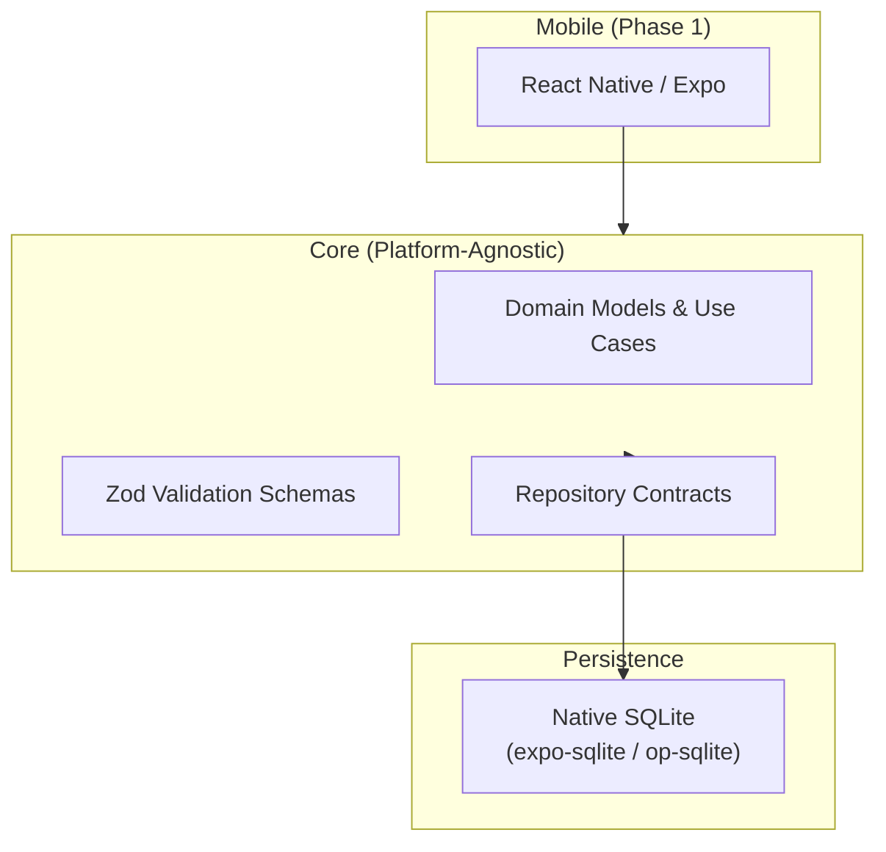

# Luna's Pet Central

An offline-first operations management system for animal shelters. Manage multiple independent shelters on a single device with full lifecycle pet tracking, clinical care scheduling, and structured data portability.

## Overview

Luna's Pet Central replaces fragmented, paper-based shelter operations with a unified digital solution. The Phase 1 MVP delivers a 100% offline-first mobile application that runs entirely on-device with no network dependency.

**Key capabilities:**
- Register and manage multiple shelters on a single device
- Track pet profiles through their complete lifecycle (intake → adoption, transfer, foster, or death)
- Schedule and log veterinary appointments with a reusable clinic directory
- Manage recurring care events with proactive reminders
- Control inventory with configurable alert rules
- Export complete structured data for backup and future cloud migration

## Architecture



**Tech Stack:**
- **Framework:** React Native (Expo Managed Workflow) + TypeScript
- **Storage:** Native SQLite via Drizzle ORM
- **State Management:** Zustand
- **Validation:** Zod schemas
- **Architecture:** Hexagonal (Clean) Architecture with scoped repository interceptors for multi-tenant isolation

## Project Structure

```
Pet-Shelter-MVP/
├── CONTEXT.md              # Domain glossary and vocabulary
├── docs/
│   ├── adr/                # Architecture Decision Records
│   │   ├── 0001-cross-platform-framework-react-native-expo.md
│   │   ├── 0002-storage-engine-native-sqlite-drizzle-orm.md
│   │   └── 0003-local-multi-tenant-isolation-scoped-repositories.md
│   ├── agents/             # Agent configuration docs
│   ├── architecture/       # Technical architecture specifications
│   └── product/            # Product requirements (PRD, BRD, RTM)
├── LICENSE
└── README.md
```

## User Documentation & Operator Guides

| Document | Description |
| :--- | :--- |
| 🚀 **[Quickstart Guide](./docs/user-guide/QUICKSTART.md)** | 2-minute orientation covering first launch, operator setup, animal intake, and care decrements. |
| 📖 **[Operator & User Manual](./docs/user-guide/USER-MANUAL.md)** | Comprehensive 12-section manual detailing all Phase 1 & Phase 2 features and workflows. |
| 🌐 **[Interactive Visual Guide](./docs/user-guide/interactive-guide.html)** | Self-contained visual guide with interactive architecture diagrams and feature walkthroughs. |

---

## Technical & Architecture Documentation

| Document | Description |
|----------|-------------|
| [CONTEXT.md](./CONTEXT.md) | Domain glossary and ubiquitous terminology |
| [PRD.md](./docs/product/PRD.md) | Product Requirements Document (v3.0) |
| [BRD.md](./docs/product/BRD.md) | Business Requirements Document |
| [RTM.md](./docs/product/RTM.md) | Requirements Traceability Matrix |
| [phase1-offline-core.md](./docs/architecture/phase1-offline-core.md) | Phase 1 Technical Architecture Specification |
| [phase2-inventory-maintenance.md](./docs/architecture/phase2-inventory-maintenance.md) | Phase 2 Categorized Inventory, Maintenance & Notifications Spec |
| [ADR-0001](./docs/adr/0001-cross-platform-framework-react-native-expo.md) | Cross-Platform Framework Selection |
| [ADR-0002](./docs/adr/0002-storage-engine-native-sqlite-drizzle-orm.md) | Storage Engine & Query Layer |
| [ADR-0003](./docs/adr/0003-local-multi-tenant-isolation-scoped-repositories.md) | Local Multi-Tenant Isolation Strategy |
| [ADR-0004](./docs/adr/0004-inventory-decrement-and-notification-escalation.md) | 1-Click Inventory Decrement & Escalation Policy |

---

## Roadmap & Delivery Status

### ✅ Phase 1: Offline-First Core (MVP v1.0 — Completed & Closed)
- Local operator auto-login profile
- Multi-shelter container isolation with dirty form safeguards
- Pet lifecycle management (intake $\rightarrow$ adoption PII capture)
- Veterinary appointment tracking & clinic directory
- Care event recurrence engine with due-date alert badges
- Structured JSON data export with SHA-256 integrity checksums
- Append-only audit logger & GDPR PII tombstoning

### ✅ Phase 2: Inventory, Maintenance & Notification Tiers (Completed & Closed)
- 5-category inventory tracking (Food, Medication, Cleaning, Equipment, Other)
- Configurable alert rules (low-stock thresholds & expiration windows evaluated in <50ms)
- 1-click usage template kits with atomic care event inventory decrements
- Maintenance task scheduling (Repair, Preventive, Cleaning) with completion logs
- Two-tier notification dispatch (Standard in-app <5s vs Custom multi-channel)
- 3-retry delivery state machine with emergency in-app banner escalation

---

## Development & Testing

```bash
# Clone the repository
git clone https://github.com/helllllllder/Pet-Shelter-MVP.git
cd Pet-Shelter-MVP

# Install dependencies
npm install

# Run comprehensive test suite (51 tests across 20 test files)
npm test

# Run strict TypeScript typechecking
npm run typecheck
```

## License

[MIT](./LICENSE)

