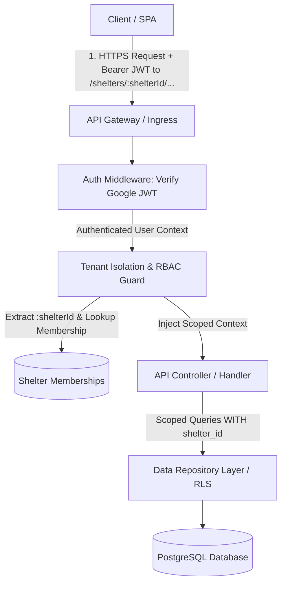
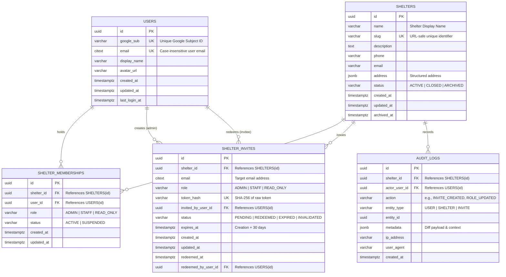

# Technical Specification: Phase 1 (MVP v1.0) Core Systems & Multi-Tenant Architecture
**Project**: Luna's Pet Central  
**Document**: `PHASE1_CORE_SYSTEM_SPEC.md`  
**Status**: PROPOSED  
**Author**: Principal Software Engineer  
**Scope**: FR01 (Google SSO), FR02 (Shelter Creation), FR03 (Identity-Bound Invites), FR04 (RBAC), NFR07 (Access Control), NFR08 (Data Isolation)  
**Multi-Tenant Routing Paradigm**: Pattern 2 (Explicit RESTful URI Paths: `/api/v1/shelters/{shelterId}/...`)

---

## 1. Executive Summary & Architecture Principles

This document specifies the core architectural foundation for **Luna's Pet Central (Phase 1 MVP v1.0)**. The architecture establishes a multi-tenant operational platform for animal shelters without a global super-admin.

### Core Architectural Principles
1. **Zero Global Privilege**: There is no platform-wide superuser. Administrative authority is strictly scoped to individual shelters.
2. **Explicit REST Resource Scoping (Pattern 2)**: All tenant-scoped operations reside explicitly under `/api/v1/shelters/{shelterId}/...`. URLs are fully self-describing, cacheable, and directly audit-loggable in standard HTTP access logs without reliance on custom request headers.
3. **Fail-Closed Tenant Isolation**: Every tenant-scoped route extracts `:shelterId` from the URI and requires an authenticated user identity with an active membership in that shelter. Requests lacking valid membership fail immediately with `403 Forbidden`.
4. **Identity-Bound Security**: Invitations are cryptographically and identity-bound to a specific Google account email (`citext`), preventing token forwarding or credential hijacking.
5. **Stateless Request Processing with Context Propagation**: Shelter context extracted from the URL route parameter is stored in server-side request context (`AsyncLocalStorage`), enforcing data scoping throughout the service and repository layers.



---

## 2. Data Models & Entity Relationship Schema

The database model is defined using PostgreSQL dialect with strict relational integrity, UUIDv7 primary keys (for time-ordered indexing), and foreign key constraints.



### 2.1 Table DDL Definitions

```sql
-- Enable necessary extensions
CREATE EXTENSION IF NOT EXISTS "uuid-ossp";
CREATE EXTENSION IF NOT EXISTS "citext";

-- Role Enumeration
CREATE TYPE shelter_role AS ENUM ('ADMIN', 'STAFF', 'READ_ONLY');

-- Shelter Status Enumeration
CREATE TYPE shelter_status AS ENUM ('ACTIVE', 'CLOSED', 'ARCHIVED');

-- Membership Status Enumeration
CREATE TYPE membership_status AS ENUM ('ACTIVE', 'SUSPENDED');

-- Invite Status Enumeration
CREATE TYPE invite_status AS ENUM ('PENDING', 'REDEEMED', 'EXPIRED', 'INVALIDATED');

-- 1. USERS
CREATE TABLE users (
    id UUID PRIMARY KEY DEFAULT gen_random_uuid(),
    google_sub VARCHAR(255) NOT NULL,
    email CITEXT NOT NULL,
    display_name VARCHAR(255) NOT NULL,
    avatar_url TEXT,
    created_at TIMESTAMPTZ NOT NULL DEFAULT CURRENT_TIMESTAMP,
    updated_at TIMESTAMPTZ NOT NULL DEFAULT CURRENT_TIMESTAMP,
    last_login_at TIMESTAMPTZ NOT NULL DEFAULT CURRENT_TIMESTAMP,
    CONSTRAINT uq_users_google_sub UNIQUE (google_sub),
    CONSTRAINT uq_users_email UNIQUE (email)
);

CREATE INDEX idx_users_email ON users(email);

-- 2. SHELTERS (Tenants)
CREATE TABLE shelters (
    id UUID PRIMARY KEY DEFAULT gen_random_uuid(),
    name VARCHAR(255) NOT NULL,
    slug VARCHAR(100) NOT NULL,
    description TEXT,
    phone VARCHAR(50),
    email VARCHAR(255),
    address JSONB DEFAULT '{}'::jsonb,
    status shelter_status NOT NULL DEFAULT 'ACTIVE',
    created_at TIMESTAMPTZ NOT NULL DEFAULT CURRENT_TIMESTAMP,
    updated_at TIMESTAMPTZ NOT NULL DEFAULT CURRENT_TIMESTAMP,
    archived_at TIMESTAMPTZ,
    CONSTRAINT uq_shelters_slug UNIQUE (slug),
    CONSTRAINT chk_shelters_name_not_empty CHECK (length(trim(name)) > 0)
);

CREATE INDEX idx_shelters_status ON shelters(status);

-- 3. SHELTER_MEMBERSHIPS (Tenant RBAC Bridge)
CREATE TABLE shelter_memberships (
    id UUID PRIMARY KEY DEFAULT gen_random_uuid(),
    shelter_id UUID NOT NULL REFERENCES shelters(id) ON DELETE RESTRICT,
    user_id UUID NOT NULL REFERENCES users(id) ON DELETE RESTRICT,
    role shelter_role NOT NULL,
    status membership_status NOT NULL DEFAULT 'ACTIVE',
    created_at TIMESTAMPTZ NOT NULL DEFAULT CURRENT_TIMESTAMP,
    updated_at TIMESTAMPTZ NOT NULL DEFAULT CURRENT_TIMESTAMP,
    CONSTRAINT uq_shelter_memberships_user_shelter UNIQUE (shelter_id, user_id)
);

CREATE INDEX idx_memberships_user ON shelter_memberships(user_id, status);
CREATE INDEX idx_memberships_shelter ON shelter_memberships(shelter_id, status);

-- 4. SHELTER_INVITES (Identity-Bound Invitations)
CREATE TABLE shelter_invites (
    id UUID PRIMARY KEY DEFAULT gen_random_uuid(),
    shelter_id UUID NOT NULL REFERENCES shelters(id) ON DELETE CASCADE,
    email CITEXT NOT NULL,
    role shelter_role NOT NULL,
    token_hash VARCHAR(64) NOT NULL, -- SHA-256 hash of high-entropy token
    invited_by_user_id UUID NOT NULL REFERENCES users(id) ON DELETE RESTRICT,
    status invite_status NOT NULL DEFAULT 'PENDING',
    expires_at TIMESTAMPTZ NOT NULL,
    created_at TIMESTAMPTZ NOT NULL DEFAULT CURRENT_TIMESTAMP,
    updated_at TIMESTAMPTZ NOT NULL DEFAULT CURRENT_TIMESTAMP,
    redeemed_at TIMESTAMPTZ,
    redeemed_by_user_id UUID REFERENCES users(id) ON DELETE SET NULL,
    CONSTRAINT uq_shelter_invites_token_hash UNIQUE (token_hash),
    CONSTRAINT chk_invite_expiry CHECK (expires_at > created_at)
);

-- Partial index to enforce at most one PENDING invite per email per shelter
CREATE UNIQUE INDEX uq_pending_invite_per_shelter_email 
ON shelter_invites (shelter_id, email) 
WHERE status = 'PENDING';

CREATE INDEX idx_shelter_invites_lookup ON shelter_invites(token_hash, status);

-- 5. AUDIT_LOGS (Immutable Activity Trail)
CREATE TABLE audit_logs (
    id UUID PRIMARY KEY DEFAULT gen_random_uuid(),
    shelter_id UUID REFERENCES shelters(id) ON DELETE SET NULL,
    actor_user_id UUID REFERENCES users(id) ON DELETE SET NULL,
    action VARCHAR(100) NOT NULL,
    entity_type VARCHAR(100) NOT NULL,
    entity_id UUID,
    metadata JSONB NOT NULL DEFAULT '{}'::jsonb,
    ip_address INET,
    user_agent TEXT,
    created_at TIMESTAMPTZ NOT NULL DEFAULT CURRENT_TIMESTAMP
);

CREATE INDEX idx_audit_logs_shelter ON audit_logs(shelter_id, created_at DESC);
```

---

## 3. The Tenant Isolation Pattern (Pattern 2: Explicit URI Scoping)

### 3.1 Request Lifecycle & Security Pipeline

All tenant-scoped API requests are processed through a sequential, deterministic security middleware pipeline based on URI routing.

```
Request Arrival: e.g. POST /api/v1/shelters/550e8400-e29b-41d4-a716-446655440000/invites
  │
  ├── 1. Bearer Token Verification (AuthMiddleware)
  │      └── Validates JWT signature & expiration from `Authorization: Bearer <token>`
  │      └── Resolves `user` entity from DB (or cached session)
  │      └── Attach `req.user`
  │
  ├── 2. URI Route Parameter Extraction (TenantRouteGuard)
  │      └── Extracts `req.params.shelterId` from URI path
  │      └── Validates UUID format (rejects malformed strings with 400 Bad Request)
  │
  ├── 3. Tenant Membership & Authorization (TenantGuard)
  │      └── Query `shelter_memberships` for `(req.user.id, shelterId)`
  │      └── Verify `membership.status == 'ACTIVE'`
  │      └── Verify `shelter.status == 'ACTIVE'`
  │      └── If not found / inactive ➔ 403 Forbidden
  │
  ├── 4. AsyncLocalStorage Context Injection
  │      └── Store `{ user, shelterId, role, membershipId }` in request execution context
  │
  └── 5. Repository Layer Scoping (RLS / Scoped ORM Queries)
         └── Guarantees all data operations filter on `WHERE shelter_id = current_shelter_id`
         └── Guarantees zero cross-tenant leakage
```

### 3.2 Role-Based Access Control (RBAC) Matrix

| Resource / Action | Admin | Staff | Read-Only |
| :--- | :---: | :---: | :---: |
| **Shelter Settings** (Edit profile, archive) | **Full** | Denied | Denied |
| **User & Staff Management** (List staff, update role, remove) | **Full** | Denied | Denied |
| **Invite Management** (Generate, resend, revoke invites) | **Full** | Denied | Denied |
| **Pet Profiles** (Create, edit, toggle adoption, outcome/archive) | **Full** | **Full** | Read-Only |
| **Care Events & Treatments** (Create, log completion, cancel) | **Full** | **Full** | Read-Only |
| **Vet Appointments & Directory** (Create, upload documents) | **Full** | **Full** | Read-Only |
| **Inventory Management** (Add items, adjust stock, alert rules) | **Full** | **Full** | Read-Only |
| **Maintenance Tasks** (Create, schedule, assign, complete) | **Full** | **Full** | Read-Only |
| **Shareable Links** (Generate, renew, revoke) | **Full** | **Full** | Denied |
| **Reports & Audit Logs** (View census, link logs, audit history) | **Full** | Operational Reports | Operational Reports |

### 3.3 Database-Level Defense in Depth (Row-Level Security)

To guarantee that queries cannot inadvertently cross tenant boundaries, PostgreSQL Row-Level Security (RLS) can be enforced on tenant-owned tables:

```sql
ALTER TABLE pets ENABLE ROW LEVEL SECURITY;

CREATE POLICY tenant_isolation_policy ON pets
    FOR ALL
    USING (shelter_id = NULLIF(current_setting('app.current_shelter_id', true), '')::uuid);
```

At the start of every transaction:
```sql
SET LOCAL app.current_shelter_id = '<current-shelter-id>';
```

---

## 4. Cryptographic Identity-Bound Invitation Pattern

### 4.1 Token Generation & Storage
1. **Entropy**: The system generates a cryptographically secure pseudorandom token:  
   `raw_token = crypto.randomBytes(32).toString('hex')` (256-bit entropy).
2. **One-Way Hash**: Only the SHA-256 hash of `raw_token` is stored in `shelter_invites.token_hash`. The plain `raw_token` is transmitted only in the generated invite URL.
3. **Identity Binding**: The invite record stores the invitee's case-insensitive email (`citext`).
4. **TTL**: The invite is created with `expires_at = now() + INTERVAL '30 days'`.
5. **Invalidation on Resend**: Creating or resending an invite for an email in a shelter updates any existing `PENDING` invite to `INVALIDATED` within the same transaction.

### 4.2 Redemption Verification State Machine

```
User clicks Invite Link (`/invite/accept?token=<raw_token>`)
  │
  ├── 1. Compute SHA-256(`raw_token`) ➔ Lookup in `shelter_invites`
  │      ├── Not Found ➔ 404 Not Found ("Invalid or unrecognized invite link")
  │      ├── Status != 'PENDING' ➔ 410 Gone / 400 Bad Request ("Invite already redeemed or invalidated")
  │      └── expires_at < NOW() ➔ Update status to 'EXPIRED' ➔ 410 Gone ("Invite has expired")
  │
  ├── 2. User Authentication Check
  │      ├── If NOT authenticated ➔ Store invite token in secure transient cookie / state ➔ Redirect to Google SSO
  │      └── If Authenticated ➔ Proceed to Step 3
  │
  ├── 3. Identity-Bound Email Match Verification
  │      ├── Compare `authenticated_user.email.toLowerCase()` === `invite.email.toLowerCase()`
  │      └── Mismatch ➔ 403 Forbidden:
  │          "This invite is bound to [invite.email]. You are logged in as [user.email]. Please sign in with the invited email."
  │
  └── 4. Atomic Transaction:
         ├── Check if membership already exists:
         │      ├── If exists ➔ Update role to `invite.role`, status = 'ACTIVE'
         │      └── If not ➔ Insert `shelter_memberships (shelter_id, user_id, role, status='ACTIVE')`
         ├── Update `shelter_invites`:
         │      set status = 'REDEEMED', redeemed_at = NOW(), redeemed_by_user_id = user.id
         └── Insert `audit_logs` entry (INVITE_REDEEMED)
```

---

## 5. API Contracts & Exact Schemas

All API contracts conform to JSON REST standards. Standard error responses follow RFC 7807 Problem Details.

### 5.1 Common Error Schema (RFC 7807)

```json
{
  "type": "https://api.lunaspetcentral.org/errors/unauthorized-tenant-access",
  "title": "Forbidden",
  "status": 403,
  "detail": "User does not hold an active membership in the requested shelter.",
  "instance": "/api/v1/shelters/550e8400-e29b-41d4-a716-446655440000/pets",
  "code": "TENANT_ACCESS_DENIED",
  "timestamp": "2026-08-28T00:30:00Z"
}
```

---

### 5.2 Authentication & User Endpoints (User-Scoped / Global)

#### `POST /api/v1/auth/google`
Authenticates a user via Google OAuth2 ID Token.

- **Headers**:
  - `Content-Type: application/json`
- **Request Body**:
```json
{
  "idToken": "eyJhbGciOiJSUzI1NiIsImtpZCI6Ij...",
  "inviteToken": "optional_raw_invite_token_hex_for_seamless_onboarding"
}
```

- **Validation Rules**:
  - `idToken`: Required, valid JWT signed by Google (`accounts.google.com`), audience matches configured Google OAuth Client ID.
  - `inviteToken`: Optional string, 64 hex characters.

- **Response 200 OK**:
```json
{
  "user": {
    "id": "3fa85f64-5717-4562-b3fc-2c963f66afa6",
    "email": "staff.member@shelter.org",
    "displayName": "Jane Doe",
    "avatarUrl": "https://lh3.googleusercontent.com/a/...",
    "createdAt": "2026-08-28T00:30:00Z"
  },
  "memberships": [
    {
      "shelterId": "9b1deb4d-3b7d-4bad-9bdd-2b0d7b3dcb6d",
      "shelterName": "Happy Paws Sanctuary",
      "shelterSlug": "happy-paws-sanctuary",
      "role": "ADMIN",
      "status": "ACTIVE"
    }
  ],
  "accessToken": "eyJhbGciOiJIUzI1NiIsInR5cCI6IkpXVCJ9...",
  "expiresIn": 86400,
  "autoRedeemedInvite": {
    "redeemed": true,
    "shelterId": "9b1deb4d-3b7d-4bad-9bdd-2b0d7b3dcb6d",
    "role": "STAFF"
  }
}
```

- **Error Codes**:
  - `400 Bad Request`: `INVALID_GOOGLE_TOKEN` — Signature verification failed or expired.
  - `503 Service Unavailable`: `GOOGLE_AUTH_UNAVAILABLE` — External Google API unreachable.

---

#### `GET /api/v1/auth/me`
Retrieves current session user details and active shelter memberships.

- **Headers**:
  - `Authorization: Bearer <accessToken>`
- **Response 200 OK**:
```json
{
  "user": {
    "id": "3fa85f64-5717-4562-b3fc-2c963f66afa6",
    "email": "staff.member@shelter.org",
    "displayName": "Jane Doe",
    "avatarUrl": "https://lh3.googleusercontent.com/a/..."
  },
  "memberships": [
    {
      "shelterId": "9b1deb4d-3b7d-4bad-9bdd-2b0d7b3dcb6d",
      "shelterName": "Happy Paws Sanctuary",
      "shelterSlug": "happy-paws-sanctuary",
      "role": "ADMIN",
      "status": "ACTIVE"
    }
  ]
}
```

---

### 5.3 Shelter Management Endpoints (User & Tenant Scoped)

#### `POST /api/v1/shelters`
Creates a new shelter. The authenticated creator is atomically granted the `ADMIN` role.

- **Headers**:
  - `Authorization: Bearer <accessToken>`
  - `Content-Type: application/json`
- **Request Body**:
```json
{
  "name": "Luna's Animal Refuge",
  "description": "A rescue and rehabilitation sanctuary in South Bay.",
  "phone": "+1-555-0199",
  "email": "contact@lunasrefuge.org",
  "address": {
    "street": "1244 Rescue Way",
    "city": "San Jose",
    "state": "CA",
    "postalCode": "95112",
    "country": "USA"
  }
}
```

- **Response 201 Created**:
```json
{
  "shelter": {
    "id": "a0eebc99-9c0b-4ef8-bb6d-6bb9bd380a11",
    "name": "Luna's Animal Refuge",
    "slug": "lunas-animal-refuge-a0ee",
    "description": "A rescue and rehabilitation sanctuary in South Bay.",
    "phone": "+1-555-0199",
    "email": "contact@lunasrefuge.org",
    "address": {
      "street": "1244 Rescue Way",
      "city": "San Jose",
      "state": "CA",
      "postalCode": "95112",
      "country": "USA"
    },
    "status": "ACTIVE",
    "createdAt": "2026-08-28T00:35:00Z"
  },
  "membership": {
    "id": "e4eaaaf2-d142-11e1-b3e4-080027620cdd",
    "shelterId": "a0eebc99-9c0b-4ef8-bb6d-6bb9bd380a11",
    "userId": "3fa85f64-5717-4562-b3fc-2c963f66afa6",
    "role": "ADMIN",
    "status": "ACTIVE"
  }
}
```

---

#### `GET /api/v1/shelters`
Lists all shelters that the authenticated user belongs to.

- **Headers**:
  - `Authorization: Bearer <accessToken>`
- **Response 200 OK**:
```json
{
  "items": [
    {
      "id": "a0eebc99-9c0b-4ef8-bb6d-6bb9bd380a11",
      "name": "Luna's Animal Refuge",
      "slug": "lunas-animal-refuge-a0ee",
      "role": "ADMIN",
      "status": "ACTIVE"
    }
  ]
}
```

---

#### `GET /api/v1/shelters/{shelterId}`
Fetches details of a specific shelter. Path-scoped to `{shelterId}`.

- **Headers**:
  - `Authorization: Bearer <accessToken>`
- **Response 200 OK**:
```json
{
  "id": "a0eebc99-9c0b-4ef8-bb6d-6bb9bd380a11",
  "name": "Luna's Animal Refuge",
  "slug": "lunas-animal-refuge-a0ee",
  "description": "A rescue and rehabilitation sanctuary in South Bay.",
  "phone": "+1-555-0199",
  "email": "contact@lunasrefuge.org",
  "address": {
    "street": "1244 Rescue Way",
    "city": "San Jose",
    "state": "CA",
    "postalCode": "95112",
    "country": "USA"
  },
  "status": "ACTIVE",
  "createdAt": "2026-08-28T00:35:00Z",
  "userRole": "ADMIN"
}
```

- **Error Codes**:
  - `403 Forbidden`: `TENANT_ACCESS_DENIED` — Authenticated user is not an active member of `{shelterId}`.
  - `404 Not Found`: `SHELTER_NOT_FOUND` — Shelter ID does not exist.

---

### 5.4 Identity-Bound Invitation Endpoints

#### `POST /api/v1/shelters/{shelterId}/invites`
Generates an Identity-Bound invitation link for an unregistered staff member. **Admin role in `{shelterId}` required**.

- **Headers**:
  - `Authorization: Bearer <accessToken>`
  - `Content-Type: application/json`
- **Request Body**:
```json
{
  "email": "new.staff@example.org",
  "role": "STAFF"
}
```

- **Validation Rules**:
  - `email`: Required, valid email string, normalized to lowercase.
  - `role`: Required, enum: `ADMIN` | `STAFF` | `READ_ONLY`.

- **Processing Logic**:
  1. Verify caller has `ADMIN` role in `{shelterId}` extracted from URL.
  2. Invalidate any existing `PENDING` invite for `({shelterId}, email)`.
  3. Generate 32-byte cryptographically secure random token (`raw_token`).
  4. Compute `token_hash = SHA-256(raw_token)`.
  5. Insert into `shelter_invites` with `expires_at = NOW() + 30 days`.
  6. Return generated invite details and full redemption URL.

- **Response 201 Created**:
```json
{
  "invite": {
    "id": "c7325b7b-232f-4889-bb20-1d89e50882e7",
    "shelterId": "a0eebc99-9c0b-4ef8-bb6d-6bb9bd380a11",
    "email": "new.staff@example.org",
    "role": "STAFF",
    "status": "PENDING",
    "expiresAt": "2026-09-27T00:35:00Z",
    "createdAt": "2026-08-28T00:35:00Z"
  },
  "inviteUrl": "https://app.lunaspetcentral.org/invite/accept?token=9f83c18b7e2d93e1a0b3c4d5e6f7a8b9c0d1e2f3a4b5c6d7e8f9a0b1c2d3e4f5"
}
```

---

#### `POST /api/v1/shelters/{shelterId}/invites/{inviteId}/resend`
Invalidates the previous invite token and generates a fresh one with a new 30-day expiration window. **Admin role in `{shelterId}` required**.

- **Headers**:
  - `Authorization: Bearer <accessToken>`
- **Response 200 OK**:
```json
{
  "invite": {
    "id": "c7325b7b-232f-4889-bb20-1d89e50882e7",
    "shelterId": "a0eebc99-9c0b-4ef8-bb6d-6bb9bd380a11",
    "email": "new.staff@example.org",
    "role": "STAFF",
    "status": "PENDING",
    "expiresAt": "2026-09-27T00:40:00Z",
    "updatedAt": "2026-08-28T00:40:00Z"
  },
  "inviteUrl": "https://app.lunaspetcentral.org/invite/accept?token=1a2b3c4d5e6f7a8b9c0d1e2f3a4b5c6d7e8f9a0b1c2d3e4f5a6b7c8d9e0f1a2b"
}
```

---

#### `GET /api/v1/invites/inspect`
Public/Anonymous endpoint to inspect invite details prior to redemption.

- **Query Parameters**:
  - `token`: Required string (64 hex characters).
- **Response 200 OK**:
```json
{
  "shelterName": "Luna's Animal Refuge",
  "invitedEmailMasked": "n***f@example.org",
  "role": "STAFF",
  "status": "PENDING",
  "expiresAt": "2026-09-27T00:35:00Z",
  "isExpired": false
}
```

- **Error Codes**:
  - `404 Not Found`: `INVITE_NOT_FOUND` — Invalid token.
  - `410 Gone`: `INVITE_INACTIVE` — Invite has expired, been redeemed, or invalidated.

---

#### `POST /api/v1/invites/accept`
Redeems an invitation and links the authenticated user to the shelter.

- **Headers**:
  - `Authorization: Bearer <accessToken>`
  - `Content-Type: application/json`
- **Request Body**:
```json
{
  "token": "9f83c18b7e2d93e1a0b3c4d5e6f7a8b9c0d1e2f3a4b5c6d7e8f9a0b1c2d3e4f5"
}
```

- **Processing Logic**:
  1. Hash token: `SHA-256(token)`.
  2. Fetch invite row where `token_hash = hash` and `status = 'PENDING'`.
  3. Validate expiration: if `expires_at < NOW()`, update status to `EXPIRED` and throw `410 Gone`.
  4. Validate email match:
     - Check `req.user.email.toLowerCase() === invite.email.toLowerCase()`.
     - If mismatch, return `403 Forbidden` (`INVITE_EMAIL_MISMATCH`).
  5. Transactionally:
     - Insert/Upsert `shelter_memberships` for `(invite.shelter_id, req.user.id)` with `role = invite.role`.
     - Update `shelter_invites` status to `REDEEMED`, `redeemed_at = NOW()`, `redeemed_by_user_id = req.user.id`.
     - Create audit log entry.

- **Response 200 OK**:
```json
{
  "success": true,
  "shelter": {
    "id": "a0eebc99-9c0b-4ef8-bb6d-6bb9bd380a11",
    "name": "Luna's Animal Refuge",
    "slug": "lunas-animal-refuge-a0ee"
  },
  "membership": {
    "role": "STAFF",
    "status": "ACTIVE"
  }
}
```

- **Error Response Example (403 Email Mismatch)**:
```json
{
  "type": "https://api.lunaspetcentral.org/errors/invite-email-mismatch",
  "title": "Forbidden - Email Mismatch",
  "status": 403,
  "detail": "This invitation is bound to new.staff@example.org. You are currently authenticated as other.user@gmail.com.",
  "code": "INVITE_EMAIL_MISMATCH",
  "instance": "/api/v1/invites/accept"
}
```

---

## 6. Edge Cases & Resilience Strategy

| Scenario | Architectural Handling |
| :--- | :--- |
| **Google SSO Outage** | Authentication endpoint returns `503 Service Unavailable` with structured retry-after header. Existing authenticated sessions with valid JWTs continue functioning unaffected until natural token expiration. |
| **Invite Email Mismatch** | Explicit `403 Forbidden` response returned with clear diagnostic messaging prompting user to switch Google accounts. Token remains `PENDING` (not burned). |
| **Concurrent Invite Acceptance** | Database row locking (`SELECT FOR UPDATE`) on the `shelter_invites` record prevents double-redemption race conditions. |
| **Last Admin Guard** | An Admin cannot have their role downgraded or membership deleted if they are the sole remaining `ADMIN` in the shelter. Returns `409 Conflict` (`LAST_ADMIN_CANNOT_LEAVE`). |
| **Forged Shelter ID in Route** | The `TenantGuard` extracts `:shelterId` from the URL and checks `(user_id, shelterId)` against active memberships in the DB. An attacker targeting a foreign shelter ID receives immediate `403 Forbidden` without accessing tenant data. |
| **Pending Invite Invalidation on Resend** | The partial unique index `uq_pending_invite_per_shelter_email` and transactional invalidation guarantees that resending an invite instantly invalidates the previous link. |

---

## 7. Traceability Matrix to Requirements

| Requirement | Spec Section Reference | Implementation Mechanism |
| :--- | :--- | :--- |
| **FR01 (Google SSO)** | Section 5.2 (`POST /auth/google`) | Token verification via Google Public Keys, auto-user provisioning |
| **FR02 (Shelter Creation)** | Section 5.3 (`POST /shelters`) | Atomic creation of `shelters` + `shelter_memberships(role=ADMIN)` |
| **FR03 (Identity-Bound Invites)** | Section 2.1, 4, 5.4 (`/shelters/{shelterId}/invites`) | 256-bit SHA-256 tokens, 30d TTL, email matching check on redemption |
| **FR04 (RBAC per Shelter)** | Section 2.1, 3.2 | `shelter_memberships` table, `shelter_role` enum (`ADMIN`, `STAFF`, `READ_ONLY`) |
| **NFR07 (Access Control)** | Section 3.1, 3.2 | Server-side `TenantGuard` and role validation middleware |
| **NFR08 (Data Isolation)** | Section 3.1, 3.3 | Explicit URI `:shelterId` parameter extraction, AsyncLocalStorage context, PostgreSQL RLS |
