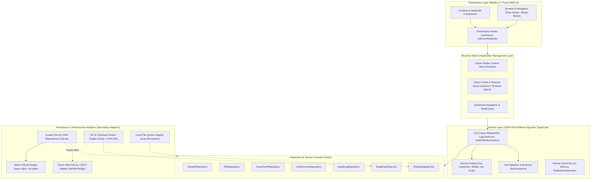
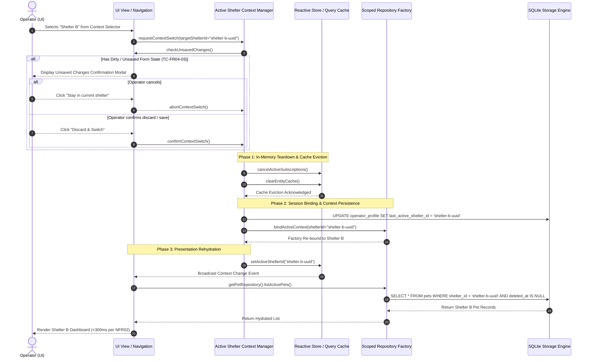

# Technical Architecture Specification: Offline-First Core (Phase 1 / MVP v1.0)

**Document Identifier:** phase1-offline-core  
**Project:** Luna's Pet Central  
**Version:** 1.0.0  
**Status:** Approved Architecture Draft  
**Author:** Principal Mobile & Systems Architect  
**Source Baseline:** PRD v3.0 (`docs/product/PRD.md`), BRD v3.0 (`docs/product/BRD.md`), RTM v2.0 (`docs/product/RTM.md`)  
**Target Milestone:** Phase 1 (MVP v1.0 — Offline-First Core)  

---

## Executive Summary & Scope

This specification defines the technical architecture for **Phase 1 (MVP v1.0)** of *Luna's Pet Central*. Phase 1 delivers a **100% offline-first, single-device mobile application (iOS & Android)** that allows a single operator to register locally (FR01), manage multiple isolated shelter profiles (FR02, FR04), execute core pet care and veterinary workflows (FR05–FR18), and export complete structured data (FR03) for backup and future cloud migration.

The architecture is built upon a **Hexagonal (Clean) Architecture** pattern implemented in **TypeScript** using **React Native (Expo)** and **Native SQLite** (via **Drizzle ORM**). All domain logic, data models, validation schemas, and repository contracts are strictly decoupled from platform-specific UI and operating system primitives. This design guarantees **100% code reuse** when the platform expands to the Web in Phase 2/3 and enables zero-downtime, lossless migration to a multi-tenant cloud backend (**PostgreSQL / Supabase + Google SSO**) in Phase 3.

---

## 1. System Architecture & Topology

### 1.1 Hexagonal / Clean Architecture Layering

The system adopts Hexagonal Architecture with strict dependency inversion: domain entities and business use cases reside at the innermost core and have zero dependencies on external frameworks, databases, or UI drivers.



### 1.2 Code-Sharing Strategy (Mobile-First to Web Expansion)

To support future Web platform expansion without rewriting business logic, the codebase is partitioned into distinct packages/modules with strict boundary rules:


| Module / Directory         | Platform Scope                    | Dependencies Allowed                     | Description                                                                                                   |
| :-------------------------- | :--------------------------------- | :---------------------------------------- | :------------------------------------------------------------------------------------------------------------- |
| `@luna/domain`             | **100% Platform-Agnostic**        | None (Pure TypeScript)                   | Domain models, business rules, enums, calculation algorithms (e.g. care recurrence dates).                    |
| `@luna/schema`             | **100% Platform-Agnostic**        | `zod`, `drizzle-orm` (core types)        | Zod validation schemas, DDL table definitions, TypeScript entity interfaces, JSON export schemas.             |
| `@luna/contracts`          | **100% Platform-Agnostic**        | `@luna/domain`, `@luna/schema`           | Repository interfaces (`IPetRepository`), service contracts (`IExportService`), session context definitions.  |
| `@luna/state`              | **100% Platform-Agnostic**        | `zustand`, `@luna/contracts`             | State management slices, context management, query cache orchestration.                                       |
| `@luna/adapter-sqlite`     | **Cross-Platform (Native + Web)** | `drizzle-orm`, driver bindings           | Drizzle implementation of repository contracts; binds to native SQLite on mobile and SQLite WASM/OPFS on web. |
| `@luna/adapter-fs`         | **Platform-Specific**             | `expo-file-system` / Web File API        | Binary storage adapter for pet photos and veterinary documents.                                               |
| `@luna/ui-mobile`          | **Mobile-Specific**               | `react-native`, `expo-*`, `@luna/state`  | Native screens, gesture handlers, mobile navigation routes.                                                   |
| `@luna/ui-web` *(Phase 3)* | **Web-Specific**                  | `react-dom`, Tailwind CSS, `@luna/state` | Responsive desktop and web portal interface consuming the identical `@luna/state` and `@luna/contracts`.      |


### 1.3 Shelter Context Switch Lifecycle

Context switching between independent shelters (FR04) requires transactional isolation: active in-flight queries must abort, in-memory caches must evict, unsaved UI state must prompt the user (TC-FR04-03), and all subsequent database queries must bind immediately to the new `active_shelter_id`.



---

## 2. Architecture Decision Records (Inline ADRs)

### ADR-001: Cross-Platform Framework Selection — React Native (Expo) + TypeScript


| Attribute    | Value                                      |
| :------------ | :------------------------------------------ |
| **Status**   | Accepted                                   |
| **Date**     | 2026-08-28                                 |
| **Deciders** | Principal Mobile Architect, Technical Lead |


#### Context

Luna's Pet Central begins in Phase 1 as a single-device mobile application (iOS/Android) but must expand in Phase 2/3 to a Web desktop platform. The business requires high developer velocity, zero language bifurcation, and near-total reuse of domain models, validation logic, and state management across mobile and web.

#### Decision

Adopt **React Native with Expo (Managed Workflow, Prebuild-ready) and TypeScript**.

#### Alternatives Considered

1. **Flutter (Dart)**: Excellent cross-platform rendering and performance. *Rejected because* Dart cannot share domain schemas (e.g. Zod), validation rules, or TypeScript models directly with modern web/Node.js tooling without duplicate codebases or code-generation overhead.
2. **Native iOS (Swift) & Android (Kotlin)**: Maximum native capabilities. *Rejected because* separate codebases triple development and maintenance costs for an offline MVP.
3. **Progressive Web App (PWA) in Capacitor / Cordova**: Fast web-to-mobile wrapper. *Rejected because* raw PWA storage on mobile OSs (iOS Safari WKWebView IndexedDB) suffers from aggressive 7-day storage eviction policies under OS memory pressure, violating data retention requirements (NFR08, NFR15).

#### Consequences & Trade-offs

- **Benefits**: 100% shared TypeScript domain logic; Expo Router enables universal navigation patterns; access to high-performance native SQLite bindings; smooth transition to React Web via shared core packages.
- **Accepted Trade-offs**: Slightly larger initial binary size than pure native apps (~25MB); must manage native bridge boundary for specialized file operations.

---

### ADR-002: Storage Engine & Query Layer — Native SQLite with Drizzle ORM


| Attribute    | Value                                      |
| :------------ | :------------------------------------------ |
| **Status**   | Accepted                                   |
| **Date**     | 2026-08-28                                 |
| **Deciders** | Principal Database Architect, Systems Lead |


#### Context

The storage layer must deliver sub-300ms query performance (NFR02), support relational joins (pets to care events, appointments to documents), enforce strict schema integrity locally, and translate 1:1 to a future cloud-hosted PostgreSQL schema (Phase 3) without requiring schema re-engineering.

#### Decision

Adopt **Native SQLite (`expo-sqlite` with next-gen synchronous/asynchronous bindings / `op-sqlite`)** controlled via **Drizzle ORM** (TypeScript-first SQL query builder and schema definition tool).

#### Alternatives Considered

1. **WatermelonDB (SQLite-backed RxDB)**: Highly optimized for React Native lazy loading. *Rejected because* WatermelonDB introduces an opinionated, proprietary sync engine and column convention that diverges from standard PostgreSQL DDL, increasing migration friction for Phase 3.
2. **Realm / MongoDB Embedded**: Object-oriented embedded database. *Rejected because* Realm uses a proprietary binary database format that cannot be queried with standard SQL tools and complicates flat JSON data export (FR03) and PostgreSQL ingestion.
3. **Pure Raw SQLite Strings**: Zero dependencies. *Rejected because* raw SQL lacks compile-time type safety, resulting in refactoring bugs and error-prone schema evolution.

#### Consequences & Trade-offs

- **Benefits**: Complete compile-time type safety with TypeScript; Drizzle schemas write to SQLite locally but generate equivalent PostgreSQL DDL with minor dialect mapping; zero runtime overhead; standard SQL indexing and foreign key enforcement.
- **Accepted Trade-offs**: Developers write relational SQL migrations rather than schema-less documents; requires compile-time migration bundle management.

---

### ADR-003: Local Multi-Tenant Isolation Strategy — Unified SQLite Database with Scoped Repository Interceptor Pattern


| Attribute    | Value                                   |
| :------------ | :--------------------------------------- |
| **Status**   | Accepted                                |
| **Date**     | 2026-08-28                              |
| **Deciders** | Principal Security & Data Architect |


#### Context

In Phase 1, a single operator can create and manage multiple shelter profiles on one device (FR02, FR04, NFR08). Data between shelters must never cross-contaminate in UI views or queries. Furthermore, internal transfers (FR10) create shadow records that span shelter boundaries, and the operator must be able to export either a single shelter or all shelters in a single operation (FR03).

#### Decision

Implement a **Unified Local SQLite Database** utilizing the **Scoped Repository Interceptor Pattern with Composite Foreign Keys**. Every query is constructed through a scoped session object that automatically injects `WHERE shelter_id = :active_shelter_id` and binds `shelter_id` on all insertions.

#### Alternatives Considered

1. **Physical Database-per-Shelter (`shelter_<uuid>.db`)**: Each shelter has its own `.sqlite` file. *Rejected because*:
  - Cross-shelter operations (such as FR10 internal transfer shadow record creation) cannot execute inside an atomic ACID transaction across separate database files without complex `ATTACH DATABASE` locks.
  - Generating an "Export All Shelters" bundle (FR03) requires orchestrating multiple SQLite connection handles and merging disparate schema versions.
  - Managing connection pools and migration lifecycles across dynamic file counts introduces significant mobile OS file handle overhead.
2. **Client-Side Ad-Hoc Filtering**: Developers manually append `where(eq(pets.shelterId, activeId))` in every UI query. *Rejected because* human error inevitably leads to data leakage (violating NFR08).

#### Consequences & Trade-offs

- **Benefits**: Single migration pipeline; atomic cross-shelter transfer transactions (FR10); unified data export engine (FR03); repository layer prevents cross-tenant leaks by construction.
- **Accepted Trade-offs**: Requires defense-in-depth safeguards (composite foreign keys and repository-level context assertions) to guarantee isolation.

---

## 3. Complete Database Schema & DDL Specifications

All entities use **UUIDv7** (time-ordered, collision-free, offline-generated 128-bit identifiers stored as canonical 36-character strings) as primary keys, and **UTC ISO-8601 strings (`YYYY-MM-DDTHH:MM:SS.sssZ`)** for all timestamp fields. Indexes are explicitly constructed to satisfy the sub-300ms search threshold (NFR02).

### 3.1 SQLite DDL (Production Copy-Paste Ready)

```sql
-- Enable foreign key constraint enforcement in SQLite connection
PRAGMA foreign_keys = ON;

-- ============================================================================
-- 1. OPERATOR PROFILE (FR01) - Single-operator device credentials & settings
-- ============================================================================
CREATE TABLE IF NOT EXISTS operator_profile (
    id TEXT PRIMARY KEY NOT NULL, -- UUIDv7
    full_name TEXT NOT NULL,
    email TEXT NOT NULL,
    phone TEXT,
    last_active_shelter_id TEXT, -- References shelters(id)
    device_install_id TEXT NOT NULL UNIQUE,
    created_at TEXT NOT NULL, -- ISO-8601 UTC
    updated_at TEXT NOT NULL  -- ISO-8601 UTC
);

-- ============================================================================
-- 2. SHELTERS (FR02, FR04) - Independent shelter containers on device
-- ============================================================================
CREATE TABLE IF NOT EXISTS shelters (
    id TEXT PRIMARY KEY NOT NULL, -- UUIDv7
    name TEXT NOT NULL,
    description TEXT,
    address TEXT,
    phone TEXT,
    email TEXT,
    is_active INTEGER NOT NULL DEFAULT 1, -- 1 = active, 0 = archived/closed
    created_at TEXT NOT NULL, -- ISO-8601 UTC
    updated_at TEXT NOT NULL  -- ISO-8601 UTC
);

CREATE INDEX IF NOT EXISTS idx_shelters_active ON shelters(is_active);

-- ============================================================================
-- 3. PETS (FR05, FR06, FR07, FR08) - Core animal profile & lifecycle records
-- ============================================================================
CREATE TABLE IF NOT EXISTS pets (
    id TEXT PRIMARY KEY NOT NULL, -- UUIDv7
    shelter_id TEXT NOT NULL,
    name TEXT NOT NULL,
    species TEXT NOT NULL, -- 'CANINE', 'FELINE', 'OTHER'
    breed TEXT NOT NULL,
    sex TEXT NOT NULL, -- 'MALE', 'FEMALE', 'UNKNOWN'
    color TEXT NOT NULL,
    date_of_birth TEXT NOT NULL, -- ISO-8601 Date: YYYY-MM-DD
    is_dob_estimated INTEGER NOT NULL DEFAULT 0, -- Boolean: 0 = false, 1 = true
    intake_origin TEXT NOT NULL, -- 'STREET_RESCUE', 'OWNER_SURRENDER', 'TRANSFER_SHELTER', 'BORN_IN_SHELTER', 'OTHER'
    intake_origin_details TEXT, -- Mandatory free text when intake_origin == 'OTHER'
    health_status TEXT NOT NULL DEFAULT 'HEALTHY', -- 'HEALTHY', 'IN_TREATMENT', 'RECOVERING'
    health_conditions TEXT, -- JSON array string of flags e.g. ["FIV", "FeLV"]
    is_available_for_adoption INTEGER NOT NULL DEFAULT 0, -- Boolean: 0 = false, 1 = true
    outcome_status TEXT NOT NULL DEFAULT 'ACTIVE', -- 'ACTIVE', 'IN_FOSTER', 'ADOPTED', 'DECEASED', 'TRANSFERRED_INTERNAL', 'TRANSFERRED_EXTERNAL'
    outcome_date TEXT, -- ISO-8601 UTC timestamp when outcome was set
    outcome_notes TEXT,
    media_references TEXT, -- JSON array of media descriptors: [{"id": "...", "type": "PHOTO", "local_uri": "..."}]
    created_at TEXT NOT NULL, -- ISO-8601 UTC
    updated_at TEXT NOT NULL, -- ISO-8601 UTC
    deleted_at TEXT, -- Soft-delete timestamp (ISO-8601 UTC)
    FOREIGN KEY (shelter_id) REFERENCES shelters(id) ON DELETE CASCADE
);

CREATE INDEX IF NOT EXISTS idx_pets_shelter_outcome ON pets(shelter_id, outcome_status, deleted_at);
CREATE INDEX IF NOT EXISTS idx_pets_shelter_species ON pets(shelter_id, species);
CREATE INDEX IF NOT EXISTS idx_pets_shelter_adoption ON pets(shelter_id, is_available_for_adoption) WHERE outcome_status = 'ACTIVE';
CREATE INDEX IF NOT EXISTS idx_pets_search ON pets(shelter_id, name COLLATE NOCASE);

-- ============================================================================
-- 4. ADOPTER DETAILS (FR09) - Captured PII upon pet adoption
-- ============================================================================
CREATE TABLE IF NOT EXISTS adopter_details (
    id TEXT PRIMARY KEY NOT NULL, -- UUIDv7
    shelter_id TEXT NOT NULL,
    pet_id TEXT NOT NULL UNIQUE,
    adopter_name TEXT NOT NULL,
    adopter_phone TEXT NOT NULL,
    adopter_address TEXT NOT NULL,
    adopted_at TEXT NOT NULL, -- ISO-8601 UTC
    notes TEXT,
    created_at TEXT NOT NULL, -- ISO-8601 UTC
    updated_at TEXT NOT NULL, -- ISO-8601 UTC
    FOREIGN KEY (shelter_id) REFERENCES shelters(id) ON DELETE CASCADE,
    FOREIGN KEY (pet_id) REFERENCES pets(id) ON DELETE CASCADE
);

CREATE INDEX IF NOT EXISTS idx_adopter_shelter ON adopter_details(shelter_id);

-- ============================================================================
-- 5. SHADOW RECORDS (FR10) - Read-only history preservation for internal transfers
-- ============================================================================
CREATE TABLE IF NOT EXISTS shadow_records (
    id TEXT PRIMARY KEY NOT NULL, -- UUIDv7
    origin_shelter_id TEXT NOT NULL,
    destination_shelter_id TEXT NOT NULL,
    origin_pet_id TEXT NOT NULL,
    destination_pet_id TEXT NOT NULL,
    transferred_at TEXT NOT NULL, -- ISO-8601 UTC
    snapshot_payload_json TEXT NOT NULL, -- Immutable JSON snapshot of original medical/care history
    created_at TEXT NOT NULL, -- ISO-8601 UTC
    FOREIGN KEY (origin_shelter_id) REFERENCES shelters(id) ON DELETE RESTRICT,
    FOREIGN KEY (destination_shelter_id) REFERENCES shelters(id) ON DELETE RESTRICT,
    FOREIGN KEY (origin_pet_id) REFERENCES pets(id) ON DELETE RESTRICT,
    FOREIGN KEY (destination_pet_id) REFERENCES pets(id) ON DELETE RESTRICT
);

CREATE INDEX IF NOT EXISTS idx_shadow_origin ON shadow_records(origin_shelter_id, origin_pet_id);
CREATE INDEX IF NOT EXISTS idx_shadow_dest ON shadow_records(destination_shelter_id, destination_pet_id);

-- ============================================================================
-- 6. VETERINARY CLINICS (FR11) - Directory of medical facilities per shelter
-- ============================================================================
CREATE TABLE IF NOT EXISTS vet_clinics (
    id TEXT PRIMARY KEY NOT NULL, -- UUIDv7
    shelter_id TEXT NOT NULL,
    name TEXT NOT NULL,
    phone TEXT NOT NULL,
    email TEXT,
    address TEXT NOT NULL,
    emergency_services INTEGER NOT NULL DEFAULT 0, -- Boolean: 0 = false, 1 = true
    notes TEXT,
    created_at TEXT NOT NULL, -- ISO-8601 UTC
    updated_at TEXT NOT NULL, -- ISO-8601 UTC
    deleted_at TEXT, -- Soft-delete
    FOREIGN KEY (shelter_id) REFERENCES shelters(id) ON DELETE CASCADE
);

CREATE INDEX IF NOT EXISTS idx_vet_clinics_shelter ON vet_clinics(shelter_id, name COLLATE NOCASE) WHERE deleted_at IS NULL;

-- ============================================================================
-- 7. VETERINARIANS (FR11) - Individual medical practitioners linked to clinics
-- ============================================================================
CREATE TABLE IF NOT EXISTS veterinarians (
    id TEXT PRIMARY KEY NOT NULL, -- UUIDv7
    shelter_id TEXT NOT NULL,
    clinic_id TEXT NOT NULL,
    name TEXT NOT NULL,
    license_number TEXT,
    phone TEXT,
    email TEXT,
    specialty TEXT, -- e.g. 'SURGERY', 'FELINE_INTERNAL_MED', 'GENERAL'
    created_at TEXT NOT NULL, -- ISO-8601 UTC
    updated_at TEXT NOT NULL, -- ISO-8601 UTC
    deleted_at TEXT, -- Soft-delete
    FOREIGN KEY (shelter_id) REFERENCES shelters(id) ON DELETE CASCADE,
    FOREIGN KEY (clinic_id) REFERENCES vet_clinics(id) ON DELETE CASCADE
);

CREATE INDEX IF NOT EXISTS idx_vets_shelter_clinic ON veterinarians(shelter_id, clinic_id) WHERE deleted_at IS NULL;

-- ============================================================================
-- 8. VETERINARY APPOINTMENTS (FR12, FR14) - Medical appointment logs
-- ============================================================================
CREATE TABLE IF NOT EXISTS vet_appointments (
    id TEXT PRIMARY KEY NOT NULL, -- UUIDv7
    shelter_id TEXT NOT NULL,
    pet_id TEXT NOT NULL,
    clinic_id TEXT NOT NULL,
    veterinarian_id TEXT,
    appointment_date TEXT NOT NULL, -- ISO-8601 UTC timestamp
    reason TEXT NOT NULL,
    diagnosis TEXT,
    prognosis TEXT,
    is_retroactive INTEGER NOT NULL DEFAULT 0, -- Boolean: 1 if entered with retroactive confirmation
    created_at TEXT NOT NULL, -- ISO-8601 UTC
    updated_at TEXT NOT NULL, -- ISO-8601 UTC
    deleted_at TEXT, -- Soft-delete (Preserves linked care events per FR14)
    FOREIGN KEY (shelter_id) REFERENCES shelters(id) ON DELETE CASCADE,
    FOREIGN KEY (pet_id) REFERENCES pets(id) ON DELETE CASCADE,
    FOREIGN KEY (clinic_id) REFERENCES vet_clinics(id) ON DELETE RESTRICT,
    FOREIGN KEY (veterinarian_id) REFERENCES veterinarians(id) ON DELETE SET NULL
);

CREATE INDEX IF NOT EXISTS idx_appointments_pet ON vet_appointments(shelter_id, pet_id, appointment_date DESC);
CREATE INDEX IF NOT EXISTS idx_appointments_date ON vet_appointments(shelter_id, appointment_date);

-- ============================================================================
-- 9. VETERINARY DOCUMENTS (FR13) - Attached PDF and image medical assets
-- ============================================================================
CREATE TABLE IF NOT EXISTS vet_documents (
    id TEXT PRIMARY KEY NOT NULL, -- UUIDv7
    shelter_id TEXT NOT NULL,
    appointment_id TEXT NOT NULL,
    file_name TEXT NOT NULL,
    file_type TEXT NOT NULL, -- 'APPLICATION_PDF', 'IMAGE_JPEG', 'IMAGE_PNG'
    file_size_bytes INTEGER NOT NULL,
    local_relative_path TEXT NOT NULL, -- Relative to app sandbox media root
    sha256_checksum TEXT NOT NULL,
    uploaded_at TEXT NOT NULL, -- ISO-8601 UTC
    created_at TEXT NOT NULL, -- ISO-8601 UTC
    FOREIGN KEY (shelter_id) REFERENCES shelters(id) ON DELETE CASCADE,
    FOREIGN KEY (appointment_id) REFERENCES vet_appointments(id) ON DELETE CASCADE
);

CREATE INDEX IF NOT EXISTS idx_vet_docs_appt ON vet_documents(shelter_id, appointment_id);

-- ============================================================================
-- 10. CARE EVENTS (FR15, FR16) - Recurring and temporary treatment definitions
-- ============================================================================
CREATE TABLE IF NOT EXISTS care_events (
    id TEXT PRIMARY KEY NOT NULL, -- UUIDv7
    shelter_id TEXT NOT NULL,
    pet_id TEXT NOT NULL,
    linked_appointment_id TEXT, -- Optional bidirectional link (FR16)
    modality TEXT NOT NULL, -- 'VACCINE', 'VERMIFUGE', 'MEDICATION', 'PHYSICAL_THERAPY', 'HOSPITALIZATION', 'OTHER'
    substance_name TEXT, -- Substance/Product name (optional for modalities like therapy)
    dosage TEXT,
    administration_instructions TEXT,
    recurrence_interval_unit TEXT, -- 'HOURS', 'DAYS', 'MONTHS', 'YEARS', 'NONE'
    recurrence_interval_value INTEGER DEFAULT 0,
    start_date TEXT NOT NULL, -- ISO-8601 Date: YYYY-MM-DD
    end_date TEXT, -- Optional ISO-8601 Date; NULL = indefinite recurrence until archived/cancelled
    status TEXT NOT NULL DEFAULT 'ACTIVE', -- 'ACTIVE', 'COMPLETED', 'CANCELLED'
    created_at TEXT NOT NULL, -- ISO-8601 UTC
    updated_at TEXT NOT NULL, -- ISO-8601 UTC
    FOREIGN KEY (shelter_id) REFERENCES shelters(id) ON DELETE CASCADE,
    FOREIGN KEY (pet_id) REFERENCES pets(id) ON DELETE CASCADE,
    FOREIGN KEY (linked_appointment_id) REFERENCES vet_appointments(id) ON DELETE SET NULL
);

CREATE INDEX IF NOT EXISTS idx_care_events_pet ON care_events(shelter_id, pet_id, status);
CREATE INDEX IF NOT EXISTS idx_care_events_appt ON care_events(shelter_id, linked_appointment_id) WHERE linked_appointment_id IS NOT NULL;

-- ============================================================================
-- 11. CARE EVENT OCCURRENCES (FR17, FR18) - Specific schedule instances
-- ============================================================================
CREATE TABLE IF NOT EXISTS care_event_occurrences (
    id TEXT PRIMARY KEY NOT NULL, -- UUIDv7
    shelter_id TEXT NOT NULL,
    care_event_id TEXT NOT NULL,
    pet_id TEXT NOT NULL,
    due_date TEXT NOT NULL, -- ISO-8601 UTC timestamp
    status TEXT NOT NULL DEFAULT 'SCHEDULED', -- 'SCHEDULED', 'DUE', 'ADMINISTERED', 'MISSED', 'CANCELLED'
    administered_at TEXT, -- ISO-8601 UTC timestamp
    administered_by_operator_name TEXT,
    notes TEXT,
    created_at TEXT NOT NULL, -- ISO-8601 UTC
    updated_at TEXT NOT NULL, -- ISO-8601 UTC
    FOREIGN KEY (shelter_id) REFERENCES shelters(id) ON DELETE CASCADE,
    FOREIGN KEY (care_event_id) REFERENCES care_events(id) ON DELETE CASCADE,
    FOREIGN KEY (pet_id) REFERENCES pets(id) ON DELETE CASCADE
);

CREATE INDEX IF NOT EXISTS idx_occurrences_due ON care_event_occurrences(shelter_id, status, due_date ASC);
CREATE INDEX IF NOT EXISTS idx_occurrences_pet ON care_event_occurrences(shelter_id, pet_id, due_date);

-- ============================================================================
-- 12. AUDIT LOGS (NFR13, NFR16) - Append-only audit trail with GDPR tombstoning
-- ============================================================================
CREATE TABLE IF NOT EXISTS audit_logs (
    id TEXT PRIMARY KEY NOT NULL, -- UUIDv7
    shelter_id TEXT, -- NULL for global operator-level actions (e.g. shelter creation)
    entity_type TEXT NOT NULL, -- 'OPERATOR', 'SHELTER', 'PET', 'APPOINTMENT', 'CARE_EVENT', 'EXPORT', 'ADOPTION'
    entity_id TEXT NOT NULL,
    action TEXT NOT NULL, -- 'CREATE', 'UPDATE', 'DELETE', 'ARCHIVE', 'EXPORT', 'GDPR_ERASURE'
    actor_name TEXT NOT NULL, -- Stored actor name or '[GDPR ERASURE VERIFIED]' if tombstoned
    actor_contact TEXT, -- Stored contact or '[GDPR ERASURE VERIFIED]' if tombstoned
    payload_diff_json TEXT, -- JSON record of changes
    ip_or_device_id TEXT NOT NULL,
    created_at TEXT NOT NULL -- ISO-8601 UTC
);

CREATE INDEX IF NOT EXISTS idx_audit_shelter_entity ON audit_logs(shelter_id, entity_type, entity_id);
CREATE INDEX IF NOT EXISTS idx_audit_created ON audit_logs(created_at DESC);
```

---

### 3.2 TypeScript Entity Interfaces

```typescript
/**
 * Core Domain Enums
 */
export type Species = 'CANINE' | 'FELINE' | 'OTHER';
export type Sex = 'MALE' | 'FEMALE' | 'UNKNOWN';
export type HealthStatus = 'HEALTHY' | 'IN_TREATMENT' | 'RECOVERING';
export type IntakeOrigin = 'STREET_RESCUE' | 'OWNER_SURRENDER' | 'TRANSFER_SHELTER' | 'BORN_IN_SHELTER' | 'OTHER';
export type PetOutcomeStatus = 'ACTIVE' | 'IN_FOSTER' | 'ADOPTED' | 'DECEASED' | 'TRANSFERRED_INTERNAL' | 'TRANSFERRED_EXTERNAL';
export type CareModality = 'VACCINE' | 'VERMIFUGE' | 'MEDICATION' | 'PHYSICAL_THERAPY' | 'HOSPITALIZATION' | 'OTHER';
export type RecurrenceUnit = 'HOURS' | 'DAYS' | 'MONTHS' | 'YEARS' | 'NONE';
export type CareOccurrenceStatus = 'SCHEDULED' | 'DUE' | 'ADMINISTERED' | 'MISSED' | 'CANCELLED';
export type DocumentMimeType = 'APPLICATION_PDF' | 'IMAGE_JPEG' | 'IMAGE_PNG';
export type AuditAction = 'CREATE' | 'UPDATE' | 'DELETE' | 'ARCHIVE' | 'EXPORT' | 'GDPR_ERASURE';

/**
 * 1. Operator Profile Entity (FR01)
 */
export interface IOperatorProfile {
  id: string; // UUIDv7
  fullName: string;
  email: string;
  phone: string | null;
  lastActiveShelterId: string | null;
  deviceInstallId: string;
  createdAt: string; // ISO-8601 UTC
  updatedAt: string; // ISO-8601 UTC
}

/**
 * 2. Shelter Container Entity (FR02, FR04)
 */
export interface IShelter {
  id: string; // UUIDv7
  name: string;
  description: string | null;
  address: string | null;
  phone: string | null;
  email: string | null;
  isActive: boolean;
  createdAt: string; // ISO-8601 UTC
  updatedAt: string; // ISO-8601 UTC
}

/**
 * 3. Pet Entity (FR05, FR06, FR07, FR08)
 */
export interface IPet {
  id: string; // UUIDv7
  shelterId: string;
  name: string;
  species: Species;
  breed: string;
  sex: Sex;
  color: string;
  dateOfBirth: string; // YYYY-MM-DD
  isDobEstimated: boolean;
  intakeOrigin: IntakeOrigin;
  intakeOriginDetails: string | null;
  healthStatus: HealthStatus;
  healthConditions: string[]; // Decoded from JSON array string
  isAvailableForAdoption: boolean;
  outcomeStatus: PetOutcomeStatus;
  outcomeDate: string | null; // ISO-8601 UTC
  outcomeNotes: string | null;
  mediaReferences: IPetMediaReference[];
  createdAt: string; // ISO-8601 UTC
  updatedAt: string; // ISO-8601 UTC
  deletedAt: string | null; // ISO-8601 UTC
}

export interface IPetMediaReference {
  id: string; // UUIDv7
  type: 'PHOTO' | 'VIDEO';
  localUri: string;
  fileName: string;
  fileSizeBytes: number;
  uploadedAt: string;
}

/**
 * 4. Adopter Details Entity (FR09)
 */
export interface IAdopterDetail {
  id: string; // UUIDv7
  shelterId: string;
  petId: string;
  adopterName: string;
  adopterPhone: string;
  adopterAddress: string;
  adoptedAt: string; // ISO-8601 UTC
  notes: string | null;
  createdAt: string; // ISO-8601 UTC
  updatedAt: string; // ISO-8601 UTC
}

/**
 * 5. Shadow Record Entity (FR10)
 */
export interface IShadowRecord {
  id: string; // UUIDv7
  originShelterId: string;
  destinationShelterId: string;
  originPetId: string;
  destinationPetId: string;
  transferredAt: string; // ISO-8601 UTC
  snapshotPayloadJson: string; // Serialized snapshot of medical/care history
  createdAt: string; // ISO-8601 UTC
}

/**
 * 6. Veterinary Clinic Entity (FR11)
 */
export interface IVetClinic {
  id: string; // UUIDv7
  shelterId: string;
  name: string;
  phone: string;
  email: string | null;
  address: string;
  emergencyServices: boolean;
  notes: string | null;
  createdAt: string; // ISO-8601 UTC
  updatedAt: string; // ISO-8601 UTC
  deletedAt: string | null;
}

/**
 * 7. Veterinarian Entity (FR11)
 */
export interface IVeterinarian {
  id: string; // UUIDv7
  shelterId: string;
  clinicId: string;
  name: string;
  licenseNumber: string | null;
  phone: string | null;
  email: string | null;
  specialty: string | null;
  createdAt: string; // ISO-8601 UTC
  updatedAt: string; // ISO-8601 UTC
  deletedAt: string | null;
}

/**
 * 8. Veterinary Appointment Entity (FR12, FR14)
 */
export interface IVetAppointment {
  id: string; // UUIDv7
  shelterId: string;
  petId: string;
  clinicId: string;
  veterinarianId: string | null;
  appointmentDate: string; // ISO-8601 UTC
  reason: string;
  diagnosis: string | null;
  prognosis: string | null;
  isRetroactive: boolean;
  createdAt: string; // ISO-8601 UTC
  updatedAt: string; // ISO-8601 UTC
  deletedAt: string | null; // Soft-delete preserve linked care events
}

/**
 * 9. Veterinary Document Entity (FR13)
 */
export interface IVetDocument {
  id: string; // UUIDv7
  shelterId: string;
  appointmentId: string;
  fileName: string;
  fileType: DocumentMimeType;
  fileSizeBytes: number;
  localRelativePath: string;
  sha256Checksum: string;
  uploadedAt: string; // ISO-8601 UTC
  createdAt: string; // ISO-8601 UTC
}

/**
 * 10. Care Event Entity (FR15, FR16)
 */
export interface ICareEvent {
  id: string; // UUIDv7
  shelterId: string;
  petId: string;
  linkedAppointmentId: string | null;
  modality: CareModality;
  substanceName: string | null;
  dosage: string | null;
  administrationInstructions: string | null;
  recurrenceIntervalUnit: RecurrenceUnit;
  recurrenceIntervalValue: number;
  startDate: string; // YYYY-MM-DD
  endDate: string | null; // YYYY-MM-DD
  status: 'ACTIVE' | 'COMPLETED' | 'CANCELLED';
  createdAt: string; // ISO-8601 UTC
  updatedAt: string; // ISO-8601 UTC
}

/**
 * 11. Care Event Occurrence Entity (FR17, FR18)
 */
export interface ICareEventOccurrence {
  id: string; // UUIDv7
  shelterId: string;
  careEventId: string;
  petId: string;
  dueDate: string; // ISO-8601 UTC
  status: CareOccurrenceStatus;
  administeredAt: string | null; // ISO-8601 UTC
  administeredByOperatorName: string | null;
  notes: string | null;
  createdAt: string; // ISO-8601 UTC
  updatedAt: string; // ISO-8601 UTC
}

/**
 * 12. Audit Log Entity (NFR13, NFR16)
 */
export interface IAuditLog {
  id: string; // UUIDv7
  shelterId: string | null;
  entityType: 'OPERATOR' | 'SHELTER' | 'PET' | 'APPOINTMENT' | 'CARE_EVENT' | 'EXPORT' | 'ADOPTION';
  entityId: string;
  action: AuditAction;
  actorName: string;
  actorContact: string | null;
  payloadDiffJson: string | null;
  ipOrDeviceId: string;
  createdAt: string; // ISO-8601 UTC
}
```

---

## 4. Local Tenant Isolation & Scoped Query Pattern

### 4.1 Architecture of the Scoped Repository Pattern

To guarantee that no UI view or service can accidentally query or mutate data belonging to another shelter (NFR08), the system prohibits direct SQL query construction in UI components. All database operations flow through a `**ScopedRepositorySession**` factory bound to the validated `active_shelter_id`.

```
┌─────────────────────────────────────────────────────────────┐
│                       UI Presentation Layer                 │
│              (Calls: usePetList(), useCareEvents())         │
└──────────────────────────────┬──────────────────────────────┘
                               │
                               ▼
┌─────────────────────────────────────────────────────────────┐
│                 Active Context Provider                     │
│  Asserts: activeShelterId IS NOT NULL & Shelter.isActive    │
└──────────────────────────────┬──────────────────────────────┘
                               │
                               ▼
┌─────────────────────────────────────────────────────────────┐
│               ScopedRepositoryFactory.create(shelterId)     │
├─────────────────────────────────────────────────────────────┤
│  - getPetRepository()        --> Injects shelter_id filter   │
│  - getCareEventRepository()  --> Injects shelter_id filter   │
│  - getVetRepository()        --> Injects shelter_id filter   │
└──────────────────────────────┬──────────────────────────────┘
                               │
                               ▼
┌─────────────────────────────────────────────────────────────┐
│               Drizzle ORM Scoped Query Builder              │
│  Automatically appends: WHERE shelter_id = :activeShelterId │
│  Automatically binds:   INSERT (shelter_id = :activeShelter)│
└──────────────────────────────┬──────────────────────────────┘
                               │
                               ▼
┌─────────────────────────────────────────────────────────────┐
│                    SQLite Storage Engine                    │
└─────────────────────────────────────────────────────────────┘
```

### 4.2 Repository Pattern Implementation Contract

```typescript
/**
 * Core Scoped Session Contract
 */
export interface IShelterSession {
  readonly activeShelterId: string;
  readonly operatorId: string;
}

/**
 * Generic Base Scoped Repository enforcing tenant boundary
 */
export abstract class BaseScopedRepository<TEntity extends { shelterId: string }> {
  protected constructor(
    protected readonly session: IShelterSession,
    protected readonly db: any // Drizzle Database Instance
  ) {
    if (!session.activeShelterId || session.activeShelterId.trim() === '') {
      throw new Error('[TENANT_ISOLATION_VIOLATION] Attempted repository operation without an active shelter context.');
    }
  }

  /**
   * Helper to ensure any input payload strictly matches the active shelter
   */
  protected enforceTenantOwnership(entity: Partial<TEntity>): void {
    if (entity.shelterId && entity.shelterId !== this.session.activeShelterId) {
      throw new Error(`[CROSS_TENANT_MUTATION_BLOCKED] Entity shelterId ${entity.shelterId} does not match active session ${this.session.activeShelterId}`);
    }
  }
}

/**
 * Concrete Pet Repository Contract enforcing shelter boundary
 */
export interface IPetRepository {
  getById(id: string): Promise<IPet | null>;
  listActive(filters?: { species?: Species; isAvailableForAdoption?: boolean }): Promise<IPet[]>;
  create(data: Omit<IPet, 'id' | 'shelterId' | 'createdAt' | 'updatedAt' | 'deletedAt'>): Promise<IPet>;
  update(id: string, updates: Partial<Omit<IPet, 'id' | 'shelterId' | 'createdAt'>>): Promise<IPet>;
  softDelete(id: string): Promise<void>;
}
```

### 4.3 Defense-in-Depth Strategy

The architecture establishes three independent defense layers:

1. **Application Layer (Context Guard)**: The presentation router blocks navigation into operational views if `active_shelter_id` is null, redirecting the user to the Shelter Setup screen (FR01/FR02).
2. **Repository Layer (Scoped Interceptor)**: Every repository method injects `eq(table.shelterId, session.activeShelterId)` at query compilation time. Any attempt to supply a mismatched `shelterId` throws an unhandled tenant error.
3. **Database Layer (Foreign Key Cascades & Constraints)**: All child records (`care_events`, `vet_appointments`, `vet_documents`) maintain strict foreign keys to `shelters(id)` on delete cascade, preventing orphan cross-references.

---

## 5. Data Export/Import Specification & JSON Schema

### 5.1 JSON Export Envelope Specification (FR03, NFR15)

The export mechanism produces a self-contained, canonical JSON file representing either an individual shelter container or all shelters managed on the device.

```json
{
  "$schema": "https://schemas.lunaspetcentral.org/v1/export-envelope.json",
  "schema_version": "1.0.0",
  "exported_at_utc": "2026-08-28T20:30:00.000Z",
  "export_type": "SINGLE_SHELTER",
  "checksum_sha256": "e3b0c44298fc1c149afbf4c8996fb92427ae41e4649b934ca495991b7852b855",
  "operator": {
    "operator_id": "018e5b47-68f0-7b2a-8742-d11234567890",
    "full_name": "Helder Souza",
    "email": "hellder.souza@proton.me"
  },
  "shelter_count": 1,
  "shelters": [
    {
      "shelter_id": "018e5b47-68f1-7c3b-9853-e22345678901",
      "name": "Luna Rescue Hub",
      "description": "Primary sanctuary facility",
      "address": "123 Sanctuary Way",
      "phone": "+1-555-0199",
      "email": "luna@rescue.org",
      "created_at": "2026-07-09T10:00:00.000Z",
      "pets": [],
      "adopter_details": [],
      "vet_clinics": [],
      "veterinarians": [],
      "vet_appointments": [],
      "vet_documents": [],
      "care_events": [],
      "care_event_occurrences": [],
      "audit_logs": []
    }
  ]
}
```

### 5.2 JSON Schema (Draft 2020-12) Definition

```json
{
  "$schema": "https://json-schema.org/draft/2020-12/schema",
  "$id": "https://schemas.lunaspetcentral.org/v1/export-envelope.json",
  "title": "LunaPetCentralExportEnvelope",
  "type": "object",
  "required": [
    "$schema",
    "schema_version",
    "exported_at_utc",
    "export_type",
    "checksum_sha256",
    "operator",
    "shelter_count",
    "shelters"
  ],
  "properties": {
    "$schema": { "type": "string" },
    "schema_version": { "type": "string", "pattern": "^[0-9]+\.[0-9]+\.[0-9]+$" },
    "exported_at_utc": { "type": "string", "format": "date-time" },
    "export_type": { "type": "string", "enum": ["SINGLE_SHELTER", "ALL_SHELTERS"] },
    "checksum_sha256": { "type": "string", "pattern": "^[a-fA-F0-9]{64}$" },
    "operator": {
      "type": "object",
      "required": ["operator_id", "full_name", "email"],
      "properties": {
        "operator_id": { "type": "string", "format": "uuid" },
        "full_name": { "type": "string" },
        "email": { "type": "string", "format": "email" }
      }
    },
    "shelter_count": { "type": "integer", "minimum": 1 },
    "shelters": {
      "type": "array",
      "items": {
        "type": "object",
        "required": [
          "shelter_id",
          "name",
          "is_active",
          "pets",
          "vet_clinics",
          "care_events"
        ],
        "properties": {
          "shelter_id": { "type": "string", "format": "uuid" },
          "name": { "type": "string" },
          "description": { "type": ["string", "null"] },
          "address": { "type": ["string", "null"] },
          "phone": { "type": ["string", "null"] },
          "email": { "type": ["string", "null"] },
          "is_active": { "type": "boolean" },
          "created_at": { "type": "string", "format": "date-time" },
          "pets": { "type": "array" },
          "adopter_details": { "type": "array" },
          "vet_clinics": { "type": "array" },
          "veterinarians": { "type": "array" },
          "vet_appointments": { "type": "array" },
          "vet_documents": { "type": "array" },
          "care_events": { "type": "array" },
          "care_event_occurrences": { "type": "array" },
          "audit_logs": { "type": "array" }
        }
      }
    }
  }
}
```

### 5.3 Binary Asset Packaging Strategy (ZIP Container)

To preserve binary media assets (pet photos FR07, vet PDF documents FR13) alongside the structured JSON export without risking Base64 payload bloat:

1. **Archive Format**: A standard compressed `.zip` archive named `luna_export_<shelter_slug>_<YYYYMMDD_HHMMSS>.lpc`.
2. **Directory Structure within Archive**:
  ```text
   luna_export_main_shelter_20260828_203000.lpc (ZIP)
   ├── manifest.json                  # Root envelope schema validated above
   ├── media/
   │   ├── pets/
   │   │   └── <pet_uuid>/
   │   │       ├── photo_01.jpg
   │   │       └── video_01.mp4
   │   └── documents/
   │       └── <appointment_uuid>/
   │           └── bloodwork_panel.pdf
   └── checksums.sha256               # SHA-256 hashes for every file in the archive
  ```
3. **Restoration / Ingestion Contract**:
  - The archive manifest is parsed and validated against `JSON Schema Draft 2020-12`.
  - Every binary file is verified against its manifest `sha256_checksum`.
  - SQLite tables are inserted within an atomic `BEGIN TRANSACTION ... COMMIT`.

---

## 6. State Management & Component Boundaries

### 6.1 State Architecture (Zustand Store Slices)

```typescript
/**
 * 1. Active Context Slice - Manages active shelter tenancy
 */
export interface IActiveContextSlice {
  activeShelterId: string | null;
  activeShelterName: string | null;
  isContextLoading: boolean;
  switchContext: (shelterId: string) => Promise[[ORCA_RICH_MD:e9a201cac757398efb061094056d570a:inline-html:%3Cvoid%3E]];
  clearContext: () => void;
}

/**
 * 2. Entity Cache Slice - Reactive local in-memory query cache
 */
export interface IEntityCacheSlice {
  petsById: Record<string, IPet>;
  careEventsById: Record<string, ICareEvent>;
  appointmentsById: Record<string, IVetAppointment>;
  invalidateAll: () => void;
}

/**
 * 3. UI State Slice - Ephemeral modal and dirty-form tracking
 */
export interface IUIStateSlice {
  isUnsavedChangesModalOpen: boolean;
  pendingContextSwitchId: string | null;
  activeSearchQuery: string;
  setPendingContextSwitch: (targetId: string | null) => void;
}
```

### 6.2 Durable vs Ephemeral State Matrix


| State Item                    | Storage Layer               | Lifecycle         | Eviction / Sync Policy                                           |
| :----------------------------- | :--------------------------- | :----------------- | :---------------------------------------------------------------- |
| **Operator Profile**          | SQLite (`operator_profile`) | Permanent         | Loaded on app launch; updated on profile edit.                   |
| **Shelter Records**           | SQLite (`shelters`)         | Permanent         | Persisted locally; cached in UI store.                           |
| **Pet & Medical Records** | SQLite (Normalized tables)  | Permanent         | Queried on demand; filtered by `active_shelter_id`.              |
| **Active Shelter Context**    | SQLite + Zustand            | Session / Durable | Stored in SQLite (`last_active_shelter_id`), rehydrated on boot. |
| **Search Filter State**       | Zustand (In-Memory)         | Ephemeral         | Cleared on screen unmount or shelter context switch.             |
| **Unsaved Form Input**        | Component Local State       | Ephemeral         | Prompted for discard on shelter switch (TC-FR04-03).             |


### 6.3 Storage Quotas & Write Failure Recovery

- **Storage Budgeting**: Mobile device sandbox quota is managed by enforcing a **15MB file size limit** on uploaded PDFs and images (FR07, FR13) and rejecting uploads if device available storage falls below 100MB (TC-FR03-04).
- **Transaction Rollbacks**: All multi-entity mutations (e.g. creating a pet with initial care events or internal transfer shadow records) execute inside `db.transaction(...)`. On exception, SQLite automatically rolls back, and the UI displays an actionable error banner.

---

## 7. Phase 3 Cloud Forward-Compatibility Blueprint

### 7.1 Local SQLite to Cloud PostgreSQL Mapping Table


| Phase 1 Local SQLite Table | Phase 3 Cloud PostgreSQL Table | Cloud Tenant / Auth Strategy | Primary Key / Index Mapping |
| :--- | :--- | :--- | :--- |
| `operator_profile` | `users` (Supabase Auth) | Migrated to Google SSO (`FR37`); `id` becomes Supabase `auth.uid()`. | `UUIDv7` → `UUID PRIMARY KEY` |
| `shelters` | `shelters` | Operator becomes `shelter_memberships (role='ADMIN')` (FR38). | `UUIDv7` → `UUID PRIMARY KEY` |
| `pets` | `pets` | Row Level Security (`RLS`) policy: `shelter_id IN (SELECT shelter_id FROM shelter_memberships WHERE user_id = auth.uid())`. | Identical columns, indexes mapped to PostgreSQL B-Tree. |
| `adopter_details` | `adopter_details` | RLS: Gated to Staff/Admin roles only (NFR07, NFR09). | `UUIDv7` → `UUID PRIMARY KEY` |
| `shadow_records` | `shadow_records` | RLS: Read-only access for participating shelters. | Identical immutable snapshot structure. |
| `vet_clinics` | `vet_clinics` | Shelter-scoped RLS. | Identical schema. |
| `veterinarians` | `veterinarians` | Shelter-scoped RLS. | Identical schema. |
| `vet_appointments` | `vet_appointments` | Shelter-scoped RLS; soft-delete preserved via `deleted_at IS NULL`. | Identical schema. |
| `vet_documents` | `vet_documents` + Supabase Storage | File blobs uploaded to private S3 bucket; signed URL generation (NFR11). | Local path mapped to S3 Object Key. |
| `care_events` | `care_events` | Shelter-scoped RLS. | Identical schema. |
| `care_event_occurrences` | `care_event_occurrences` | Push notification triggers via Cloud Functions (NFR06). | Identical schema. |
| `audit_logs` | `audit_logs` | Append-only PostgreSQL trigger; PII tombstoning on GDPR deletion. | Identical schema. |


### 7.2 Migration Assumptions & Guardrails

1. **UUIDv7 Primary Key Stability**: Because all primary keys generated in Phase 1 are UUIDv7, offline-generated records never collide with existing cloud records upon bulk ingestion.
2. **Timezone Standardization**: All timestamps stored strictly in UTC ISO-8601 strings, eliminating timezone conversion skew during cloud ingestion.
3. **Zero SQLite-Specific Features**: The local schema strictly avoids SQLite auto-increment integers, dynamic column typing, or non-standard SQL functions, ensuring that `drizzle-orm` can ingest and migrate the schema directly into PostgreSQL without transformation scripts.

---

## 8. Requirements Traceability & Verification Matrix


| Requirement ID   | Requirement Name                           | Spec Section          | Technical Verification Method                                                               |
| :---------------- | :------------------------------------------ | :--------------------- | :------------------------------------------------------------------------------------------- |
| **FR01**         | Local Operator Profile Registration        | Section 3.1, 3.2      | Verify `operator_profile` table insertion with local device install ID.                     |
| **FR02**         | Local Shelter Creation & Multi-Shelter | Section 3.1, 3.2      | Verify `shelters` table CRUD with `is_active` flag.                                         |
| **FR03**         | Local Data Export for Portability          | Section 5.1, 5.2, 5.3 | Execute JSON envelope validation against Draft 2020-12 schema and SHA-256 checksums.        |
| **FR04**         | Shelter Context Switching                  | Section 1.3, 4.1, 4.2 | Verify cache invalidation sequence and dirty-form warning (TC-FR04-03).                     |
| **FR05–FR07**    | Pet Profiles & Media                   | Section 3.1, 3.2      | Verify `pets` DDL constraints: intake origin 'OTHER', estimated DOB flag, media references. |
| **FR08–FR09**    | Pet Lifecycle & Adopter Capture        | Section 3.1, 3.2      | Verify outcome transitions and `adopter_details` foreign key constraint.                    |
| **FR10**         | Shadow Records on Internal Transfer        | Section 3.1, 3.2      | Verify `shadow_records` snapshot payload integrity across shelters.                         |
| **FR11–FR14**    | Vet Directory & Appointments           | Section 3.1, 3.2      | Verify `vet_clinics`, `vet_appointments` soft-delete preserving linked care events.         |
| **FR15–FR18**    | Care Events & Reminders                | Section 3.1, 3.2      | Verify `care_events` recurrence calculations and occurrence due dates.                      |
| **NFR02**        | Sub-300ms Search Performance               | Section 3.1           | B-tree index coverage verified on all `shelter_id` and search fields.                       |
| **NFR08**        | Data Isolation                             | Section 4.1, 4.2, 4.3 | Scoped Repository pattern guarantees zero cross-shelter data leakage.                       |
| **NFR13, NFR16** | Audit Logging & GDPR Tombstoning       | Section 3.1, 3.2      | Verify append-only `audit_logs` schema with `[GDPR ERASURE VERIFIED]` support.              |


---\n